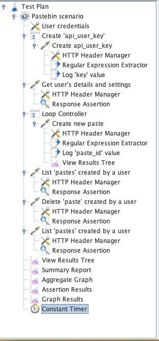

# Pastebin Jmeter Test Plan

# Table of contents
1. [Folder content](#content)
2. [REST API ](#rest_api)
3. [Jmeter scenario](#test_plan)
4. [CSV data set config](#data_set)

## Folder content <a name="content"></a>

* REST APIs - example of requests that are used in Jmeter test plan
* Scenario1.jmx - Jmeter test plan
* testUuserCreds.csv - CSV data set config for Jmeter test plan

## REST API <a name="rest_api"></a>

### Create 'api_user_key' Using The API Member Login System[^[Developers API](https://pastebin.com/api#1)]

```
Request: POST /api/api_login.php
Host: pastebin.com
Body: api_dev_key=<devKey>&api_user_name=<userName>&api_user_password=<password>
```

*Response*: ID for api_user_key to use in the next requests

### Getting user’s details and settings

```
Request: POST /api/api_post.php
Host: pastebin.com
Body: api_option=userdetails&api_dev_key=<devKey>&api_user_key=<userKey>
```
*Response*: general information about user’s account in XML format

### Create new paste 

```
Request: POST /api/api_post.php
Host: pastebin.com
Body: api_option=paste&api_dev_key=<devKey>&	&api_paste_name=justmyfilename.php&api_paste_private=1&api_paste_expire_date=1H&api_user_key=<userKey>
```
*Response*: URL to a new paste

### List pastes created by user

```
Request: POST /api/api_post.php
Host: pastebin.com
Body: api_option=list&api_dev_key=<devKey>&api_user_key=<userKey>&api_results_limit=20
```
*Response*: List of all pasts created by user or ‘No pastes found.’ if user doesn’t have any pastes created

### Delete paste created by user

```
Request: POST /api/api_post.php HTTP/1.1
Host: pastebin.com
Body: api_option=delete&api_dev_key=<devKey>&api_user_key=<userKey>&api_paste_key=<pasteId>
```
*Response*: ‘Paste Removed’ if paste id is correct


## Jmeter test plan <a name="test_plan"></a>




## CSV data set config <a name="data_set"></a>

testUuserCreds.csv has to be filled out with appropriate credentials